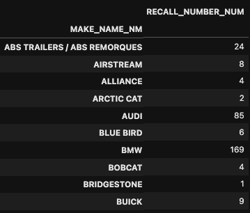
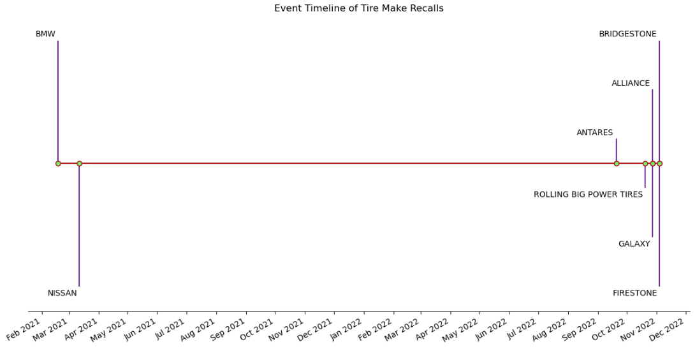

# <b> Vehicle Recalls </b>

This database is used to record and store details about recall campaigns, including the make and model of the recalled product, the issue that prompted the recall, the number of products affected, and the steps that need to be taken to address the issue. The database is designed to be easily searchable, so that consumers and industry professionals can quickly access information about the recalls that are most relevant to them. The database can be searched by product type, manufacturer, model year, and other criteria, which makes it easy to find information about specific recalls.

Transport Canada, as a regulatory body, uses this database to monitor the safety of vehicles and related products on Canadian roads. By tracking and publishing recall information, the database helps to ensure that consumers are aware of potential safety issues, and that manufacturers are held accountable for addressing them. The database also helps to promote transparency and accountability in the automotive industry, by making it easy for consumers to find information about recalls and the steps that manufacturers are taking to address them. Overall, the Vehicle Recalls Database is an important tool for improving the safety of vehicles, tires, and child car seats on Canadian roads and to protect the consumer.

#

## Data Analysis
#

<b>Question: </b> How many vehicles of a specific make have been recalled in total?

<b>Answer: </b> Distribution if vehicle recall by Make is illustrated in the following pie chart which shows BWM, Hyundai, Mercedes-Benz, Porsche and Ford have higher volume of recalls during this period of 2001 till 2022

#

<b>Question: </b> What are the most recent vehicle recalls in Canada?

<b>Answer: </b> The following illustration shows the most recent vehicle recalls in Canada in the last quarter of 2022.

The data produced gives a better picture as to seeing which make has been having the most issues. The reason as to why this may be can vary. It may be electrical, tires, motor and many others reasons.

#

<b>Question: </b> How many vehicles of a specific make and model have been recalled in the past year for the vehicle models with more than 17 recall counts?

<b>Answer:</b> In the last year of 2022, highest number of recalls made by FORD are for the following models C-MAX, ESCAPE and TRANSIT CONNECT

Illustration can be reviewed for various vehicle Make like FORD, HYUNDAI, PORSCHE, MERCEDES-BENZ, CAMPAGNA MOTORS, NOVA BUS and BMW for the respective count of recalls per models made in the last year.

#

<b>Question: </b> How does the number of recalls compared for leading manufracturers?

<b>Answer:</b> Comparative view of the total number of vehicle recalls in this last 22 years, per manufacturer is as shown below.

Risk of vehicle recall due to manufacturer fault by leading manufacturers is as follows. 
This plot shows that the distrubution for BMW recall was high during 2002 till 2010, similarly the Mercedes-Benz recalls were at high from 2005 till 2017. 

There were negligible manufacturer fault recall happened for Toyota vehicle in compared to it's peers during this last 22 years. Hence, we recommend Toyota as a leading vehicle manufacturer.

#

<b>Question: </b> What are the Tire makers with most recent recalls?

<b>Answer</b> Following data analysis indicates that the brands recently recalled was:
- Firestone and Bridgestone during November 2022

- Alliance and Galaxy around late October 2022

-  Rolling Big Power Tires mid October 2022

-  Antares early September 2022 

- Almost a year gap with the car companies Nissan and BMW recalling their vehicles around early 2021

Manufacturers often issue product recalls due to reported defects or safety concerns

Although it’s a car company, Nissan has reported a high frequency of recalls due to tire related issues in comparison to dedicated tire manufacturing companies.

#

<b>Question: </b> How does the number of recalls for a specific make and model compare to other vehicles in SUV category?

<b>Answer: </b>> Using a dynamic code to select any specific make and model, we have analyzed the recalls for BWM 3 SERIES SUV compared to other  SUVs.

Average number of SUV recalls have gradually increased since 2010, except there is a recent dip in 2022. 

Similarly, BMW 3 SERIES SUV have recalled units which have increased progressively in the same trend during this period of 2010 till 2022; although the number of recalls for total BWM SUVs in the market have declined since 2015. 

Following plots illustrates the same.

#

<b>Question: </b>Is there a relationship between the vehicle recalls and the temperature of the month?

<b>Answer</b> According to the vehicle recalls vs temperature chart, there is no considerable relationship between the minimum temperature of a month and the total number of recalls of the month. Hence, we conlcude there is no such relationship between the vehicle recalls and the temperature of the month, where there are extreme weather conditions in Canada.

#

## Resources
* [ Vehicle Recall data updated in last 60 days](https://open.canada.ca/data/en/dataset/1991fef6-9dfe-40e2-a0c6-19c60ddf4a02)
* [Weather data](https://www.weatherbit.io/api/climate-normals )

#

## Installation Instruction

To run this program, the following tools need to be installed.
* [GIT](https://git-scm.com/downloads)
* [CONDA](https://docs.conda.io/projects/conda/en/latest/user-guide/install/windows.html)
* [JUPYTER LAB](https://jupyterlab.readthedocs.io/en/stable/getting_started/installation.html)

Once the above liost of softwares are installed, please execute the following commands inside the project directory to run with the analysis reports.
* conda activate dev     # to activate the dev environment 
* jupyter lab            # to launch the jypyter notebook 
