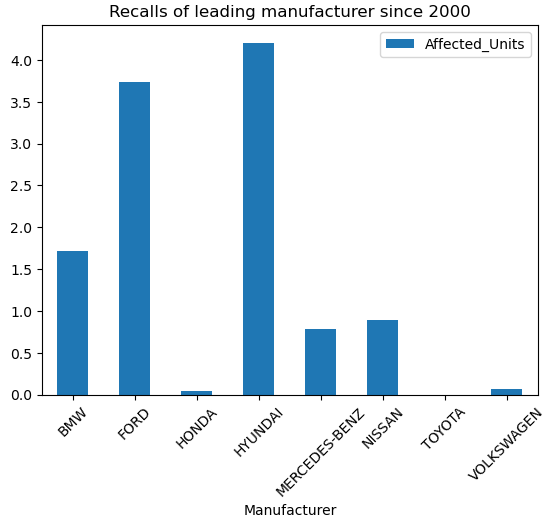
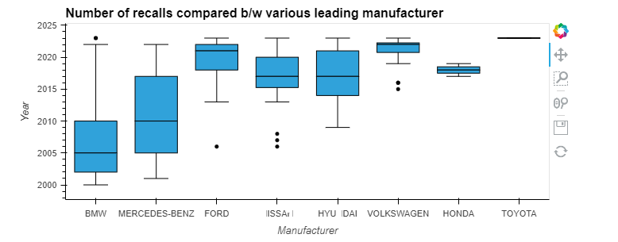
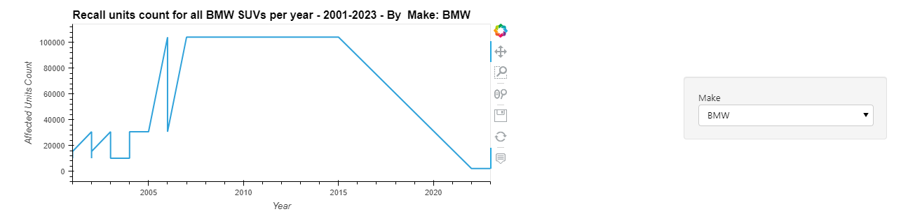

# <b> Vehicle Recalls </b>

This database is used to record and store details about recall campaigns, including the make and model of the recalled product, the issue that prompted the recall, the number of products affected, and the steps that need to be taken to address the issue. The database is designed to be easily searchable, so that consumers and industry professionals can quickly access information about the recalls that are most relevant to them. The database can be searched by product type, manufacturer, model year, and other criteria, which makes it easy to find information about specific recalls.

Transport Canada, as a regulatory body, uses this database to monitor the safety of vehicles and related products on Canadian roads. By tracking and publishing recall information, the database helps to ensure that consumers are aware of potential safety issues, and that manufacturers are held accountable for addressing them. The database also helps to promote transparency and accountability in the automotive industry, by making it easy for consumers to find information about recalls and the steps that manufacturers are taking to address them. Overall, the Vehicle Recalls Database is an important tool for improving the safety of vehicles, tires, and child car seats on Canadian roads and to protect the consumer.

#

## Data Analysis
#

<b> Question: </b> How does the number of recalls compared for leading manufracturers?

<b>Answer:</b> Comparative view of the total number of vehicle recalls in this last 22 years, per manufacturer is as shown below.

Risk of vehicle recall due to manufacturer fault by leading manufacturers is as follows. 
This plot shows that the distrubution for BMW recall was high during 2002 till 2010, similarly the Mercedes-Benz recalls were at high from 2005 till 2017. 

There were negligible manufacturer fault recall happened for Toyota vehicle in compared to it's peers during this last 22 years. Hence, we recommend Toyota as a leading vehicle manufacturer.

#

<b>Question: </b> How does the number of recalls for a specific make and model compare to other vehicles in SUV category?

<b>Answer: </b>> Using a dynamic code to select any specific make and model, we have analyzed the recalls for BWM 3 SERIES SUV compared to other  SUVs.

Average number of SUV recalls have gradually increased since 2010, except there is a recent dip in 2022. 

Similarly, BMW 3 SERIES SUV have recalled units which have increased progressively in the same trend during this period of 2010 till 2022; although the number of recalls for total BWM SUVs in the market have declined since 2015. 

Following plots illustrates the same.

